# Insane Terrarium

A 2D browser game inspired by the classic Insaniquarium — but with reptiles, amphibians, and a terrarium twist. Feed your animals, collect coins, fend off poachers, and hatch eggs to advance through 5 increasingly challenging levels.

<p align="center">
  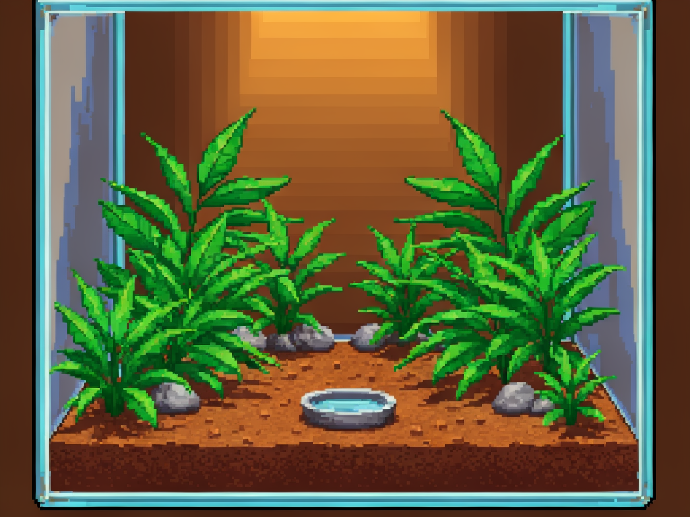
</p>

## Gameplay

- **Feed** your animals by clicking anywhere in the terrarium to drop bugs
- **Collect coins** that well-fed animals drop
- **Buy** new animals and food upgrades from the shop
- **Defend** against poachers trying to steal your animals (Level 2+)
- **Complete levels** by purchasing all 3 egg pieces
- **Choose helper pets** between levels for unique passive bonuses

## Animals

Collect and raise 5 unique reptiles and amphibians, each with different coin values and unlock levels:

<p align="center">
  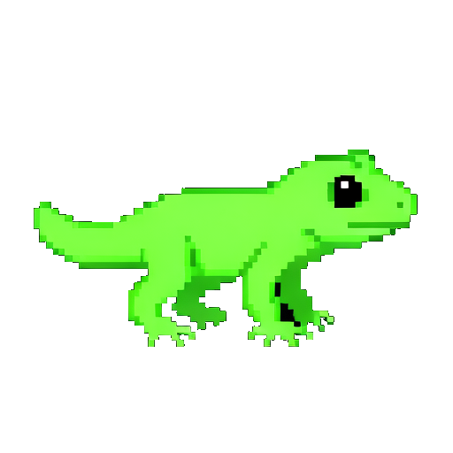
  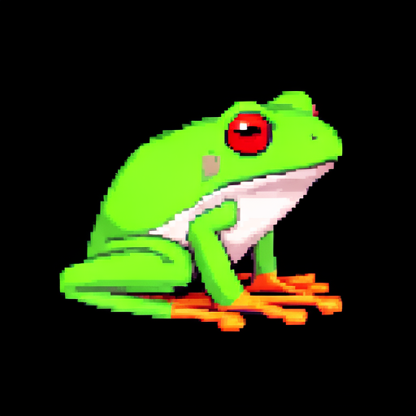
  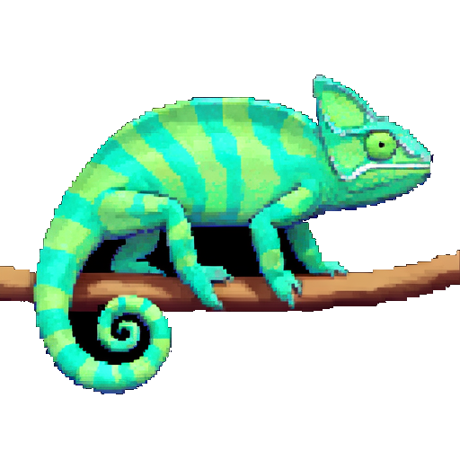
  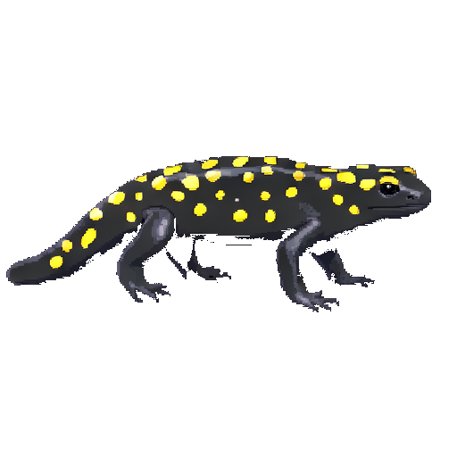
  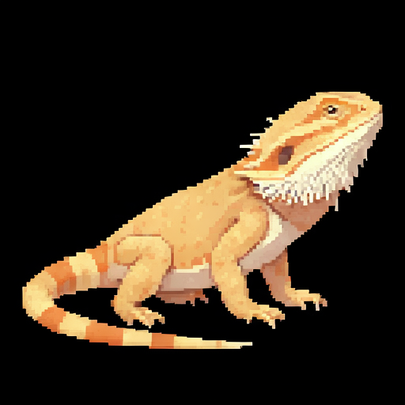
</p>

| Animal | Cost | Coin Drop | Unlock |
|--------|------|-----------|--------|
| Small Gecko | 100 | 15 every 8s | Level 1 |
| Tree Frog | 200 | 30 every 10s | Level 1 |
| Chameleon | 500 | 80 every 15s | Level 2 |
| Salamander | 750 | 100 every 12s | Level 3 |
| Bearded Dragon | 1500 | 250 every 18s | Level 4 |

## Helper Pets

Between levels, choose from 8 helper pets that provide passive bonuses throughout the rest of the game:

<p align="center">
  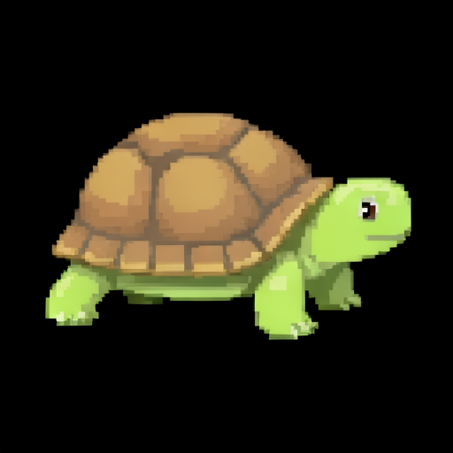
  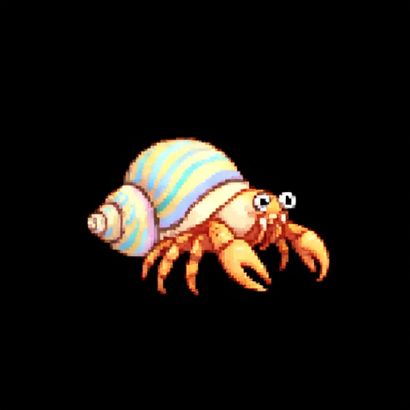
  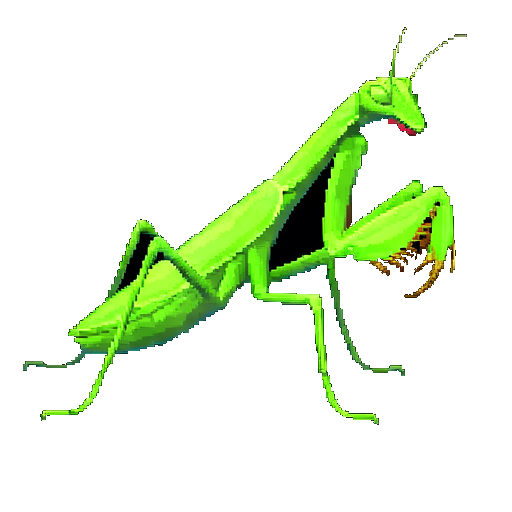
  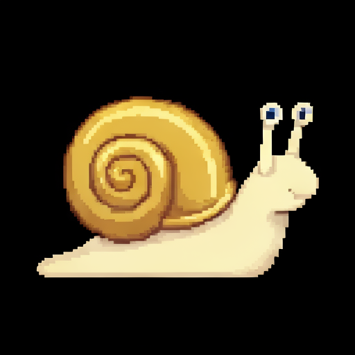
  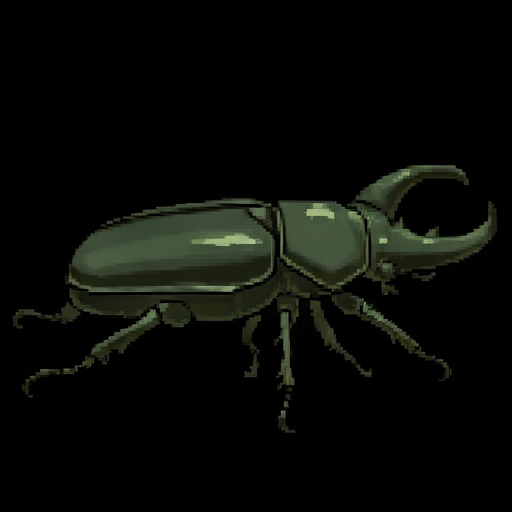
  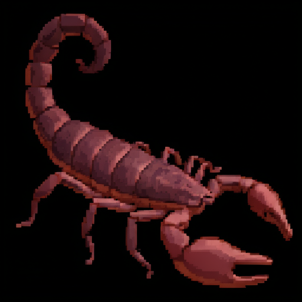
  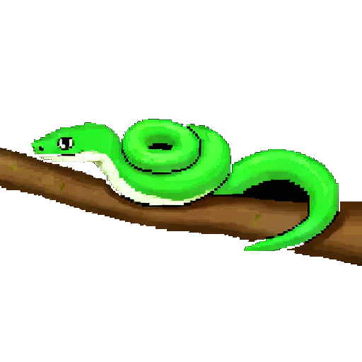
  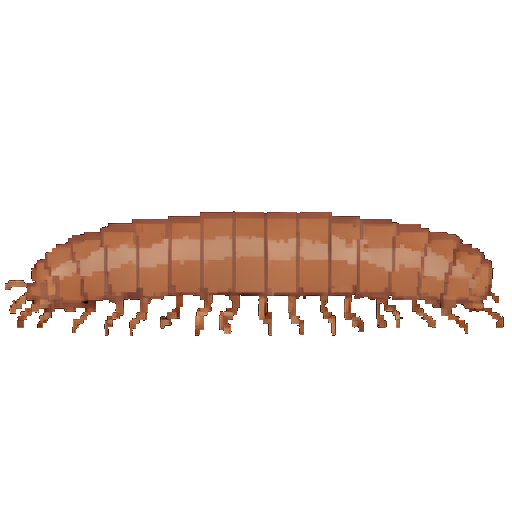
</p>

| Pet | Role | Effect |
|-----|------|--------|
| Tortoise | Auto-Feeder | Drops a cricket every 20s |
| Hermit Crab | Coin Collector | Auto-collects nearby coins |
| Praying Mantis | Guard | Auto-clicks poacher 1/sec |
| Snail | Coin Booster | Nearby animals drop +50% value |
| Beetle | Food Upgrader | All food fills 2x hunger |
| Scorpion | Intimidator | Poacher moves 30% slower |
| Tree Snake | Breeder | 10% chance to duplicate animal on feed |
| Millipede | Scavenger | Produces 1 coin every 10s |

## Items

<p align="center">
  
  &nbsp;&nbsp;
  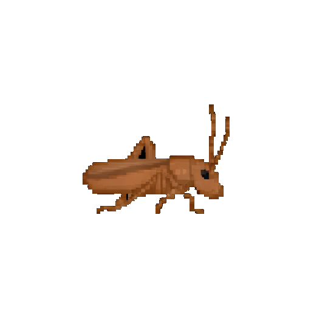
  &nbsp;&nbsp;
  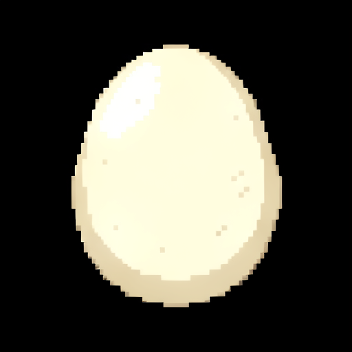
  &nbsp;&nbsp;
  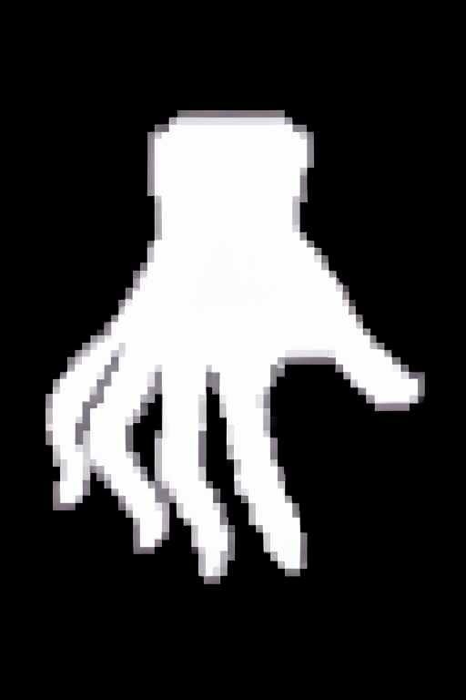
</p>

- **Coins** — Dropped by happy animals. Click to collect!
- **Food** — Crickets (free), Mealworms (5 coins), Dubia Roaches (15 coins)
- **Egg Pieces** — Buy all 3 to complete each level
- **Poacher** — Click rapidly to fend off! Appears from Level 2 onward

## Tech Stack

- **[Phaser 3](https://phaser.io/)** — Game framework (Arcade Physics, tweens, animations)
- **TypeScript** — Type-safe game logic
- **Vite** — Fast dev server and production bundler
- **[FLUX.2](https://blackforestlabs.ai/)** — All pixel art sprites AI-generated with FLUX.2 Klein 9B

## Getting Started

```bash
# Install dependencies
npm install

# Start dev server (http://localhost:8080)
npm run dev

# Production build
npm run build
```

## Project Structure

```
src/game/
  config/       — Game balance data (animals, food, levels, helpers)
  entities/     — Animal, Food, Coin, Poacher, HelperPet, ThoughtBubble
  managers/     — Economy, Level, and Helper pet persistence
  scenes/       — Boot, Preload, Menu, Game, Shop, Win, GameOver
  systems/      — PoacherAI, HelperPetAI
  ui/           — HUD, ShopBar, ShopItem, HealthBar, Tutorial
public/assets/  — All game sprites, backgrounds, and UI elements
```

## License

MIT
